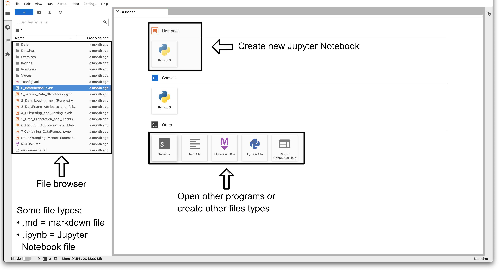
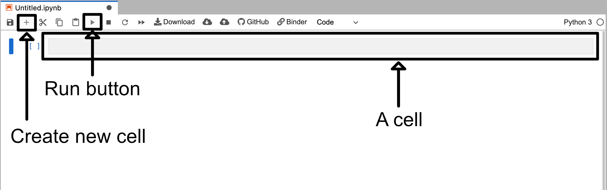
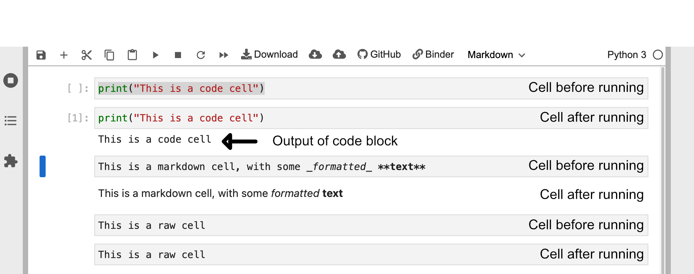

## Notebook Basics

When you load up the binder webpage linked in the previous lesson you should be presented with a site that looks something like the image below.

This site contains a variety of buttons to create various file types. However, for now we are going to click on the "Python 3" box beneath the Notebook label. This button is next to the arrow labeled "Create new Jupyter Notebook".

Once you click on it you will be presented with a new screen which will look something like the image below (note that the image has been cropped to reduce space). Here we have a blank cell ready to be used.

This cell is a code cell that you can type in. For example if you type in some python code like `print("This is a code cell")` and then click the run button you will see the output appear beneath the cell.

### Cell Types

Cells are the base unit in Jupyter notebooks. A notebook is essentially just a collection of cells of different types. In Jupyter notebooks there are three primary types of cells:

- **Code** cells
  - Code cells treat everything typed inside them as code
  - When they are "run" they will run the code they find inside them
- **Markdown** cells
  - Markdown cells treat everything typed inside them as markdown
  - When they are "run" they will format the text inside them based on markdown
- **Raw** cells
  - These cells treat everything inside them as raw text
  - If you "run" these cells nothing will happen

If you double click the jupiter notebook called "02_insert_name" that can be found in the file browser side tab you will be presented with three different cells that each correspond to one cell type. You can select the top cell and then click the run button three times to run all three cells.

> ## Running Cells
>
> You can also run a selected cell by pressing <kbd>Shift</kbd>+<kbd>Return</kbd>
>
{: .callout}

### Editing Cells

You can edit cells after running them by clicking on the cell like normal text. However, for markdown cells you will need to double click on the cell area in order revert it back into a cell.

Markdown and raw cells can be edited and run repeatedly without much issue. However, when editing code blocks you have to be more careful.

When you run a code cell you are running that piece of code. Even if you delete or edit the code block after running it the changes it made will remain until the Kernel is restarted. 
