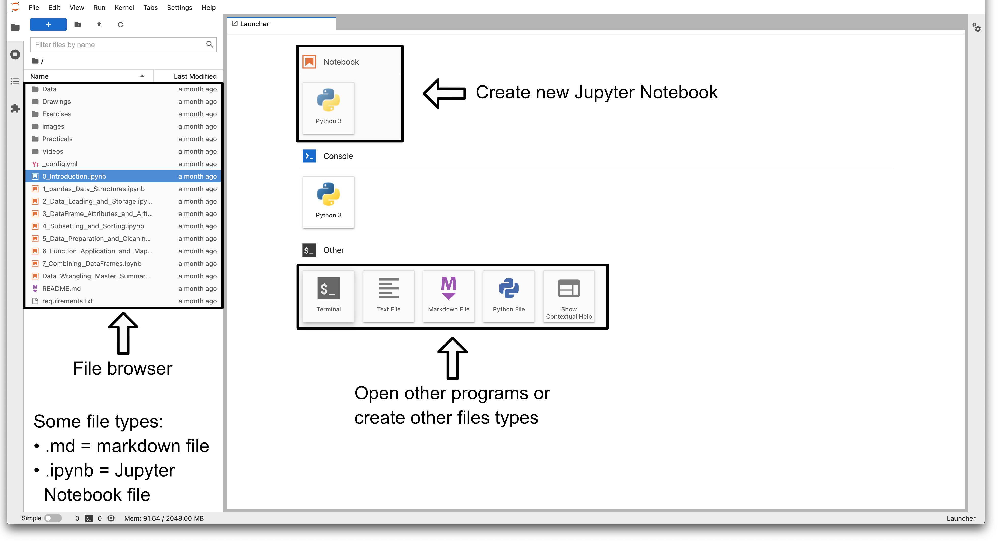
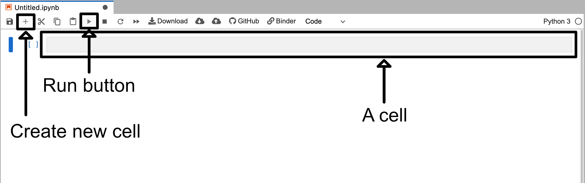
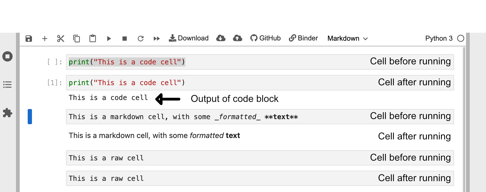
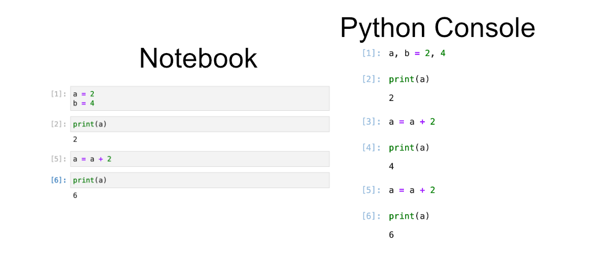
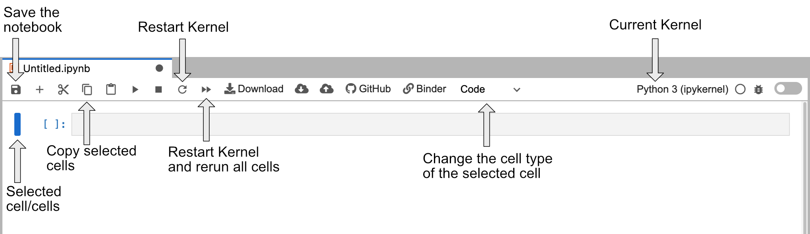

## Notebook Basics

The button above will take you to the associated binder website for this lesson. When you load up the binder webpage you should be presented with a site that looks something like the image below.

This site contains a variety of buttons to create various file types. However, for now we are going to do two things.

1. Double click on the "notebook" directory in the file browser
   - This directory contains all the Jupyter notebooks associated with this lesson
2. Click on the "Python 3" box beneath the Notebook label. This button is next to the arrow labeled "Create new Jupyter Notebook"
   - This will create a Jupyter notebook called "Untitled.ipynb" with a single blank cell

Once you click on on the Python 3 button under the notebook label you will be presented with a new screen which will look something like the image below (note that the image has been cropped to reduce space).

This notebook is blank except for a single cell. This blank cell is a code cell that you can type in. For example if you type in some python code like `print("This is a code cell")` and then click the run button you will see the output appear beneath the cell.

### Cell Types

Cells are the base unit in Jupyter notebooks. A notebook is essentially just a collection of cells of different types. In Jupyter notebooks there are three primary types of cells:

- **Code** cells
  - Code cells treat everything typed inside them as code
  - When they are "run" they will run the code they find inside them
- **Markdown** cells
  - Markdown cells treat everything typed inside them as markdown
  - When they are "run" they will format the text inside them based on jupyter markdown
- **Raw** cells
  - These cells treat everything inside them as raw text
  - If you "run" these cells nothing will happen

If you double click the jupiter notebook called "02-jupyter-notebook-interface.ipynb" that can be found in the file browser side tab you will be presented with a notebook that already has some cells filled in. Underneath the header "Cell Types" you will find three different cells that each correspond to one type of cell. You can select the top cell and then click the run button three times to run all three cells of these cells.

> ## Running Cells
>
> You can also run a selected cell by pressing <kbd>Shift</kbd>+<kbd>Return</kbd>
>
{: .callout}

You will see that the action performed after running a cell is different for each of the cells.

### Editing Cells

You can also edit cells after running them by clicking on the cell like normal text. For markdown cells you will need to double click on the cell area in order revert it back into a editable format.

Markdown and raw cells can be edited and run repeatedly without much issue. However, when editing code blocks you have to be more careful. When you run a code cell you are running that piece of code. Even if you delete or edit the code block after running it the changes it made will remain until the Kernel is restarted.

A good way to think about code cell execution in a notebook is that you are essentially copy pasting the code cell into a python console. The image below gives a visual example of this with the notebook cells on the left, and a python code that does the same set of commands on the right. You can try running the cells found in the left image by looking for the header "Editing Cells" in the Binder notebook "02-jupyter-notebook-interface.ipynb".

To show the dangers of rerunning cells we can try rerunning the two bottom cells containing the code `a = a + 2` and `print(a)`. This will be reflected as a fifth and sixth command executed in the python console. You can see this reflected in the Python console below where the same commands have been issued in the same order. So despite the fact that we only have four cells of python we have executed 6 cells worth of code.

> ## Rerunning Cells
>
> Rerunning code cells will erase the output of that code cell and update the counter next to the cell with the most recent time the cell was run.
>
{: .callout}

Rerunning code cells is **not recommended** since it obscures what the notebook's code cells are doing and can make it very difficult for anyone reading your notebook to accurately rerun your analysis.

### Jupyter Notebook Cheatsheet

The image below is a cheatsheet of some of the buttons not discussed in this episode that might be good to know for the future. Feel free to come back to it if you are confused later on.

