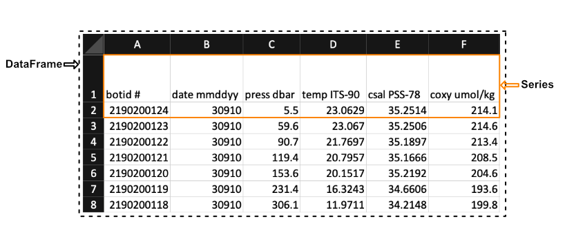

## Pandas Data Structures

For this episode you should follow along inside the Jupyter notebook associated with this episode. The jupyter notebooks for this entire lesson can be found in Binder ([Link to lesson's Binder website](https://mybinder.org/v2/gh/CI-TRACS/Data_Wrangling_with_Computational_Notebooks/HEAD)). You will have to navigate to the "notebook" directory in the file browser to find the notebook associated with this episode.

Before we start loading data into Pandas we need to become familiar with 2 of the primary data structures of Pandas:

- Series
- DataFrames

The reason we use `Series` and `DataFrames` rather than native python data structures to hold our data is because there are additional attributes and methods associated with `Series` and `DataFrames` that will be useful for wrangling and analytics. One of the primary benefits of `Series` and `DataFrames` over native python data structures is that it is a very natural way to describe a data set in an excel-like manner by referencing the rows and columns of our data with labels of our choosing.

## Pandas `Series` Vs. `DataFrames`

Pandas has two principal data structures, `Series` and `DataFrames`. If you are familiar with Microsoft's Excel application then you can liken `Series` to single columns (or rows) in an Excel sheet and `DataFrames` to entire tables (or spreadsheets).

We see in the image above that a `Series` in the context of Excel could be the first row of the spreadsheet, while a `DataFrames` would be the entire spreadsheet. In other words, a `DataFrames` is simply a collection of labeled `Series`.

## Pandas Data Types

When creating a `Series` Pandas will store all the data as the same type. The mapping from the native python types to what they would be in Pandas is summarized below.

| Python Type       | Equivalent Pandas Type | Description                                                                                                       |
| :---------------- | :--------------------- | :---------------------------------------------------------------------------------------------------------------- |
| `string or mixed` | `object`               | Columns contain partially or completely made up from strings                                                      |
| `int`             | `int64`                | Columns with numeric (integer) values. The 64 here refers  to size of the memory space allocated to this type |
| `float`           | `float64`              | Columns with floating points numbers (numbers with decimal points)                                                |
| `bool`            | `bool`                 | True/False values                                                                                                 |
| `datetime`        | `datetime`             | Date and/or time values                                                                                                   |

## Pandas `DataFrames` Basics

`DataFrames` are essentially ordered collections of `Series` with two associated `Index` objects, one to label rows and another to label columns. Reiterating the example mentioned earlier, it helps to think of `DataFrames` as MS. Excel spreadsheets where each row (or column) as an individual `Series`.

You can create `DataFrames` from either loading in a file e.g. a csv file or by converting it from a native Python data structure. However, here we will be focusing on loading data from a file and turning it into a `DataFrame`.

> ## Creating Pandas `Series`
>
> You can also create Pandas `Series` from files or native python data structures ([Link to more info](https://pandas.pydata.org/pandas-docs/stable/user_guide/dsintro.html)).
>
{: .callout}

Before we can load in data from a file we need to load the `pandas` package. Pandas is often imported alongside `as pd` to reduce the amount of characters needed to use the different methods within it.

~~~
import pandas as pd
~~~
{: .language-python}

### Loading and Parsing Data

Pandas can load in data from a variety of file formats. However, in most cases you will be loading in data from a plain text file since this is one of the most common and simple ways to store data. Plain text files only contain text without any special formatting or code e.g. `.txt`, `.csv`, or `.tsv` files.

To store data in a plain text file you need a standard way of distinguishing the individual data entries. For example, suppose a file contained the following text:

~~~
,column1,column2,column3,
row1,a,b,c
row2,d,e,f
row3,g,h,i
~~~
{: .output}

A human would see the text above and may be able to discern the 3 columns and 3 rows and the individual data entries and see that the file contains a table that looks like the one below.

|      | column 1 | column 2 | column 3 |
| ---- | -------- | -------- | -------- |
| row1 | a        | b        | c        |
| row2 | d        | e        | f        |
| row3 | g        | h        | i        |

However, a computer would have no idea how to parse this without any direction; to a computer the text above is just one string of characters. To help the computer parse the text, we could tell it that each data entry is separated by a column and each row is separate by a new line. This way of organizing data is called a plain text file format.

Most of the plain text file formats fall into one of the following two categories: **Delimited** and **Fixed Width**

- Delimitted files are organized such that columns and rows are seperated by a certain character called a delimiter
- Fixed width files are those where each entry in a column has a fixed number of characters

We will focus on the delimited .csv file type. csv is an acronym which stands for '**C**omma **S**eparated **V**alues' and informs us that the column entries are delimited by commas and the rows are delimited by a new line. So, the example we discussed in this cell conforms to the .csv format.

Included in the Pandas toolkit is a [collection](https://pandas.pydata.org/pandas-docs/stable/user_guide/io.html) of parsing functions to read and build `DataFrames` from data that is stored in a variety of formats. The Pandas function which parses and builds a `DataFrame` from a generic delimited plain text file is `read_csv()`. To run `read_csv()` with the default settings we only need to provide 1 positional argument, the path to the file we want to read. If we wanted to read a file in the same directory as our notebook called `p` and put the data into a new Pandas `DataFrame`, `df`, we would type `df = pd.read_csv(p)`.

However, parsing plain text files can become a complicated procedure. To aid in the process, Pandas provides a lot of optional parameters that may be set when calling the `read_csv()` function. To learn more, see the `read_csv()` [documentation](https://pandas.pydata.org/docs/reference/api/pandas.read_csv.html), which summarizes all of the parameters. We will be covering many of the most important parameters throughout the rest of this lesson.

By default `read_csv()` will separate data entries when it encounters a comma and will separate rows by new lines encoded by '\n'. If we wanted to change this behavior so that `read_csv()` separates by tabs (encoded with \t), then we can set the optional parameter `sep = '\t'`. For instance, if we wanted to read the data in the file 'tsv_example.tsv', which is a tab separated values file, and save the data in a Pandas `DataFrame` called `df`, then we would type:

~~~
df = pd.read_csv('data/tsv_example.tsv', sep='\t')
~~~
{: .language-python}

Though `read_csv()` can handle `.tsv` files, there is a specific parsing function for `.tsv` files: `read_table()`. The difference between `read_table()` and `read_csv()` is that the default behavior for the latter is to separate using commas instead of tabs `\t`. The `read_table()` documentation is available at this [link](https://pandas.pydata.org/pandas-docs/stable/reference/api/pandas.read_table.html).

To perform the same operation (that is reading the data in the file `tsv_exampletsv` and save the data in a Pandas `DataFrame` called `df`), we may use the `read_table()` function without having to define our delimiter, since the default parameters will correctly parse our file.

~~~
df = pd.read_table('data/tsv_example.tsv')
~~~
{: .language-python}

Both methods will lead to an equivalent `DataFrame`.

In the previous examples we loaded the entire dataset from the file we gave Pandas. However, when working with large datasets it is good practice to load your data in small pieces before loading the entire dataset to ensure that the file is parsed correctly. Small data sets are more manageable and errors are easier to spot, while large data sets take more time to parse. So, a good workflow is to read a small portion of the data and analyze the resulting data frame to see if you need to modify any of the default behaviors of the read function.

To load only up to a limited number of rows we can use the `nrows` parameter for both `read_table()` and `read_csv()`. For example, the file E3_tara_w1.csv is a csv file with over 200 rows, but if we wanted to read only the first 5 rows of this file we can call the Pandas `read_csv()` function and set `nrows = 5`:

~~~
df = pd.read_csv('data/tsv_example.tsv', nrows=5)
df.shape # Returns the number of rows and columns of the DataFrame 'df' (rows, columns)
~~~
{: .language-python}

~~~
(3, 7)
~~~
{: .output}

We see that the `DataFrame` `df`, that we saved the data in, has a shape attribute of `(3, 7)`. This means that there are 3 rows (since we set `nrows=3`) and 7 columns (all the columns of the dataset).

## Headers and Indexes

When we loaded the previous datasets `read_csv()` assumed that the first row in our .csv file contained headers for each of the columns. If we want to load in a dataset that does not contain a header row we can tell `read_csv()` that there is no header by setting `header=None`.

~~~
df = pd.read_csv("data/noheader_example.csv", header=None)
df
~~~
{: .language-python}

However, this does not mean that the `DataFrame` does not have headers but rather that Pandas will set them to be an integer value. An example is shown in the figure below:

You might also notice that there is also a corresponding integer number in the far left side of each row. This is the index that is essentially the "name" for each row. If we have a column that is specifies each row in the input file we can tell Pandas to use that column instead of the default of using a integer. This can be done by e.g. setting `index_col='unique_id'` however, if you don't have any headers you can also specify the column by using its integer location e.g. `index_col=0`. **Note that the integer location of a column goes from left to right and starts at 0.**

~~~
df = pd.read_csv('data/noheader_example.csv', header=None, index_col=0)
df
~~~
{: .language-python}

You can change the name of the index column by setting the index name attribute of the dataframe `df.index.name = 'unique_id'`.

## Common Data Loading Problems

Though data storage in plain text files should follow certain formats like .csv for '**C**omma **S**eparated **V**alues' and .tsv for '**T**ab **S**eparated **V**alues', there is still some ambiguity on how things like missing entries, and comments should be denoted. For this reason Pandas has implemented functionality into the `read_table()` and `read_csv()` to help 'clean' plain text data.

Below we will go through two examples of common issues when loading in data.

### Missing Values

There are often missing values in a real-world data set. These missing entries may be identifiable in the dataset by a number of different tags, like 'NA', 'N.A.', 'na', 'missing', etc. It is important to properly identify missing values when creating a `DataFrame` since certain `DataFrame` methods rely on the missing values being accounted for. For example, the `count()` method of a `DataFrame` returns the number of non missing values in each column. If we want this to be an accurate count, then we need to be sure of pointing out all the tags which represent 'missing' to Pandas.

For example, if we were to load in a .csv where missing values are 'Null' and not specify this then Pandas will load these values in as objects. To let Pandas know that we want to interpret these values as missing values we can add `na_values='Null'`.

~~~
df = pd.read_csv("data/null_values_example.csv", na_values='Null')
df
~~~
{: .language-python}

**Without `na_values='Null'`:**

**With `na_values='Null'`:**

> ## Auto NaN values
>
> Pandas will interpret certain values as being NaN values even without user input. For example if 'NULL' is found then Pandas will treat it as a missing value and treat it as a NaN value.
>
{: .callout}

## Writing Data in Text Format

Now that we are familiar with the reading mechanisms that Pandas has implemented for us, writing `DataFrames` to text files follows naturally. Pandas `DataFrames` have a collection of `to_<filetype>` methods we can call; we will focus on `to_csv()`. `to_csv()` takes the parameter path (the name and location of the file you are writing) and will either create a new file or overwrite the existing file with the same name.

`to_csv()` has a number of optional parameters that you may find useful, all of which can be found in the [Pandas documentation](https://pandas.pydata.org/pandas-docs/stable/reference/api/pandas.DataFrame.to_csv.html).

~~~
df.to_csv('data/new_file.csv')
~~~
{: .language-python}
