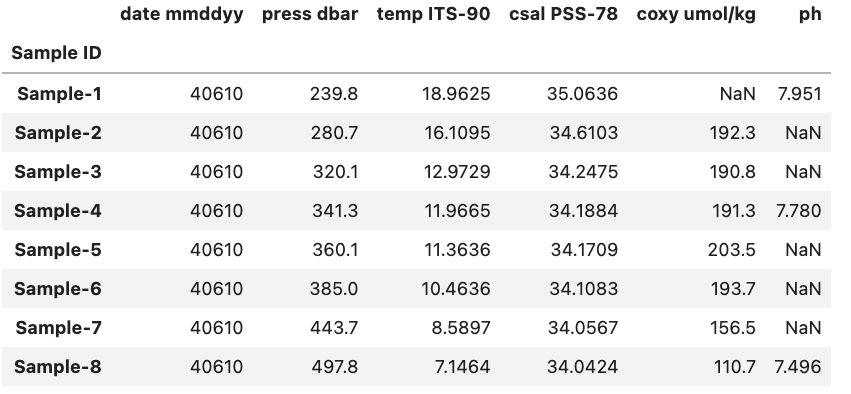
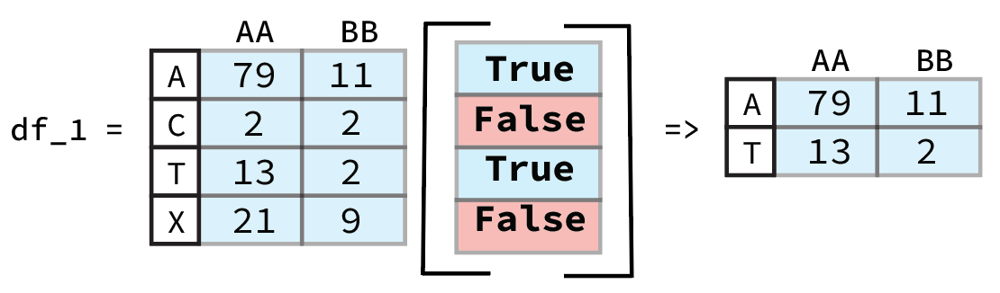
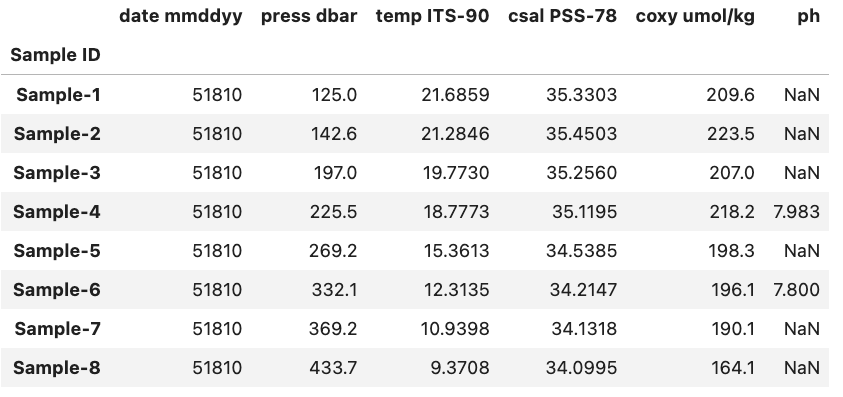

# Selection, Subsetting and Sorting a `DataFrame`

When exploring our data we will often want to focus our attention to specific rows, columns, and entries that satisfy certain conditions. We may want to either look at a single column of the data or work with a subset of the original data. This situation may occur because the source of your data was probably not using the information for the exact same purpose.

Furthermore, it is often helpful to sort our data set using a particular relation to identify patterns and to understand the data's structure. For example, suppose the original data set we acquire and want to analyze describes a sport team's performance for each game during a season and it is original ordered in chronological order. It may be interesting to sort the game play statistics using a different relation such as number of points scored to easily identify high and low scoring games.

As with previous episodes you should follow along in the notebook starting with '04' that can be found at the following link [Link to Binder](https://mybinder.org/v2/gh/CI-TRACS/Data_Wrangling_with_Computational_Notebooks/HEAD).

## Selection

Selecting data from a `DataFrame` is very easy and builds on concepts we discussed in the previous episode. As mentioned previously, in a `DataFrame` we have column names called headers and row names called indexes. Depending on how we loaded the data these might be integers or some other ID.

If we have the example `DataFrame` seen in the image below we can select and/or subset various combinations of rows and columns by using Pandas.

### Selecting Columns

To start off lets focus on subsetting columns. If we have a `DataFrame` called `df` and a column called 'ph' we can subset the `DataFrame` using `df['ph']`.

~~~
df['ph']
~~~
{: .language-python}

~~~
Sample ID
Sample-1    7.951
Sample-2      NaN
Sample-3      NaN
Sample-4    7.780
Sample-5      NaN
Sample-6      NaN
Sample-7      NaN
Sample-8    7.496
Name: ph, dtype: float64
~~~
{: .output}

### Selecting Rows

If on the other hand we want to access a subset rows we have to use a slightly different approach. While previously we could just pass the name of the column inside brackets if we want to access one or more rows we need to use the `.loc` or `.iloc` methods.

So if we again have a `DataFrame` called `df` and a row called 'Sample-1' we can access it using `df.loc['Sample-1', df.columns]`.

~~~
df.loc['Sample-1', df.columns]
~~~
{: .language-python}

~~~
date mmddyy     40610.0000
press dbar        239.8000
temp ITS-90        18.9625
csal PSS-78        35.0636
coxy umol/kg           NaN
ph                  7.9510
Name: Sample-1, dtype: float64
~~~
{: .output}

The key difference between `.loc` and `.iloc` is that `.loc` relies on the names of the indexes and headers while `.iloc` relies instead on the index and header number. Here `df.columns` is providing the all the header names in the `DataFrame` called `df` and letting pandas know that we want a single row, but all of the header in the `DataFrame`.

If we were to use `.iloc` instead of `.loc` for the previous example and we know that 'Sample-1' is at index position 0 we would use `df.iloc[0, :]` and get the same result. You might notice that we also had to change `df.columns` to `:` when we used `.iloc` this is because `df.columns` provides the names of all the headers which is fine to do with `.loc` but not `.iloc`.

~~~
df.iloc[0, :]
~~~
{: .language-python}

~~~
date mmddyy     40610.0000
press dbar        239.8000
temp ITS-90        18.9625
csal PSS-78        35.0636
coxy umol/kg           NaN
ph                  7.9510
Name: Sample-1, dtype: float64
~~~
{: .output}

> ## The `:` operator
>
> When used inside a bracket the `:` operator will return the range between the two values it is given. For example if we had a python list `x` with the following values ['a', 'b', 'c', 'd', 'e'] and wanted to select 'b', 'c', and 'd' we can do this very concisely using the `:` operator.
>
> ~~~
> x = ['a', 'b', 'c', 'd', 'e']
> x[2:5]
> ~~~
> {: .language-python}
>
> With the output:
> 
> ~~~
> ['b', 'c', 'd']
> ~~~
> {: .output}
>
{: .callout}

### Selecting Columns and Rows Simultaneously

As we saw in the previous section we can select one or more rows and/or columns to view. For example if we wanted to view the 'ph' entry of 'Sample-1' from the previous example we could use `.loc` in the following manner.

~~~
df.loc['Sample-1', 'ph']
~~~
{: .language-python}

~~~
7.951
~~~
{: .output}

If we wanted to select multiple columns e.g. both the 'ph' and 'Longitude' columns we can change the code bit to fit our needs.

~~~
df.loc['Sample-1', ['ph', 'Longitude']]
~~~
{: .language-python}

~~~
temp ITS-90    18.9625
ph              7.9510
Name: Sample-1, dtype: float64
~~~
{: .output}

> ## Using `.iloc`
>
> You can just as well use `.iloc` for the two examples above, but you will need to change the index and headers to their respective integer values i.e. the row number(s) and the header number(s).
>
{: .callout}

## Subsetting

Comparison operations ("<" , ">" , "==" , ">=" , "<=" , "!=") can be applied to pandas `Series` and `DataFrame`s in the same vectorized fashion as arithmetic operations except the returned object is a `Series` or `DataFrame` of booleans (either `True` or `False`).

### Within a Single `DataFrame`

To start let focus on a single `DataFrame` to better understand how comparison operations work in Pandas. As an example lets say that we have a `DataFrame` like the one below stored in `df`:

If we wanted to identify which of the above samples come from a depth above 380 we start by finding  column 'press dbar' using a less than condition of 380. 

~~~
df['press dbar'] < 380
~~~
{: .language-python}

The output will be a Pandas `Series` containing a boolean value for each row in the `df` that looks like this.

~~~
Sample ID
Sample-1     True
Sample-2     True
Sample-3     True
Sample-4     True
Sample-5     True
Sample-6    False
Sample-7    False
Sample-8    False
Name: press dbar, dtype: bool
~~~
{: .output}

We can see that the first row and the last row are both `True` while the remaining rows are `False` and a quick look at the original data confirms that this is correct based on our condition. However, looking back at the original `DataFrame` is very tedious. If we instead want to view/save the rows that were found to have a depth < 380 we can either save the output `Series` to a variable and use that or directly place the previously used code within a bracket. Both methods are equivalent and shown below.

~~~
good_rows = df['press dbar'] < 380
df[good_rows]
~~~
{: .language-python}

Is equivalent to:

~~~
df[df['press dbar'] < 380]
~~~
{: .language-python}

Either of these code bits will generate the same output:

~~~
           date mmddyy  press dbar  temp ITS-90  csal PSS-78  coxy umol/kg     ph
Sample ID                                                                        
Sample-1         40610       239.8      18.9625      35.0636           NaN  7.951
Sample-2         40610       280.7      16.1095      34.6103         192.3    NaN
Sample-3         40610       320.1      12.9729      34.2475         190.8    NaN
Sample-4         40610       341.3      11.9665      34.1884         191.3  7.780
Sample-5         40610       360.1      11.3636      34.1709         203.5    NaN
~~~
{: .output}

It might seem strange that we don't need to use `.loc` or `.iloc` despite the fact that we are selecting rows. This is due to the fact that the output of `df['press dbar'] < 380` is a Pandas `Series` that contains information on the row and Pandas inherently assumes that when it is passed a boolean list like this that we want to select those rows that are `True`. A graphic example of this is shown below.

From previous Pandas Data Wrangling workshop ([Link to Github](https://github.com/hawaiidatascience/pandas_data_wrangling/blob/master/4_Subsetting_and_Sorting.ipynb)).

### Between Different `DataFrame`s

There will be some cases where you might want to compare different `DataFrame`s with one another. This is very straight forward using an approach similar to the one we used for a single `DataFrame`.

To demonstrate this we will reuse the `DataFrame` used in the previous example alongside a new one called `df2` with same columns as `df` but new row entries. The structure of `df2` is shown below.

As an example lets say that we wanted to compare each sample in `df` with the equivalent sample in `df2` (based on their row index value) and find those where the `df` sample's oxygen concentration `coxy umol/kg` is less than `df2`. To do this we start by comparing the two `DataFrame`.

~~~
df.loc[:, "coxy umol/kg"] < df2.loc[:, "coxy umol/kg"]
~~~
{: .language-python}

Below you can see the output of the code.

~~~
Sample ID
Sample-1    False
Sample-2     True
Sample-3     True
Sample-4     True
Sample-5    False
Sample-6     True
Sample-7     True
Sample-8     True
Name: coxy umol/kg, dtype: bool
~~~
{: .output}

So we can see that there are two samples, Sample-1 and Sample-5, where the oxygen concentration is smaller for `df` compared to `df2`. If we inspect both `DataFrame`s we can easily see that this is the case for Sample-5. However, in the case for Sample-1 it is less clear since we don't have a comparison between two numeric values and instead `NaN < 216.6`. When it comes to comparisons between `NaN` values and numeric values by default it will always return `False`. If we were to instead check for samples where `df` has a greater oxygen concentration we would run into the same result for Sample-1 i.e. the result would be `False`

~~~
df.loc[:, "coxy umol/kg"] > df2.loc[:, "coxy umol/kg"]
~~~
{: .language-python}

~~~
Sample ID
Sample-1    False
Sample-2    False
Sample-3    False
Sample-4    False
Sample-5     True
Sample-6    False
Sample-7    False
Sample-8    False
Name: coxy umol/kg, dtype: bool
~~~
{: .output}

> ## Column Specification
>
> If you do not specify a column to compare and instead do e.g. `df.loc[:] < df2.loc[:]` you will get a comparison of every column and a `DataFrame` containing those values as an output:
> ~~~
> df.loc[:] < df2.loc[:]
> ~~~
> {: .language-python}
>
> ~~~
           date mmddyy  press dbar  temp ITS-90  csal PSS-78  coxy umol/kg     ph
> Sample ID                                                                        
> Sample-1          True       False         True         True         False  False
> Sample-2          True       False         True         True          True  False
> Sample-3          True       False         True         True          True  False
> Sample-4          True       False         True         True          True   True
> Sample-5          True       False         True         True         False  False
> Sample-6          True       False         True         True          True  False
> Sample-7          True       False         True         True          True  False
> Sample-8          True       False         True         True          True  False
> ~~~
> {: .output}
{: .callout}

## Sorting

There may also come a time when we want to see the data sorted by some criterion in order to explore potential patterns and order statistics of the entries based on a relation. For example, we might want to order a `DataFrame` by the depth that a sample was recovered from. **Note: we can also sort the order of the columns based on their names**

There are two primary methods to sort a `DataFrame` either by the index or by a value. The index is rather straight forward, you use the method `sort_index()` to sort the `DataFrame` and provide an axis (0=row, 1=columns). We can reuse `df` and since the index is already sorted we can sort the order of the columns instead.

~~~
df.sort_index(axis=1)
~~~
{: .language-python}

With the output:

~~~
           coxy umol/kg  csal PSS-78  date mmddyy     ph  press dbar  temp ITS-90
Sample ID                                                                        
Sample-1            NaN      35.0636        40610  7.951       239.8      18.9625
Sample-2          192.3      34.6103        40610    NaN       280.7      16.1095
Sample-3          190.8      34.2475        40610    NaN       320.1      12.9729
Sample-4          191.3      34.1884        40610  7.780       341.3      11.9665
Sample-5          203.5      34.1709        40610    NaN       360.1      11.3636
Sample-6          193.7      34.1083        40610    NaN       385.0      10.4636
Sample-7          156.5      34.0567        40610    NaN       443.7       8.5897
Sample-8          110.7      34.0424        40610  7.496       497.8       7.1464
~~~
{: .output}

Here we can see that we've ordered the columns alphabetically.

If we want to instead order the `DataFrame` based on the value in a particular column or row we instead use `sort_values()`. We can again use the pressure i.e. 'press dbar' column as an example and sort the rows by greatest to smallest pressure value.

~~~
df.sort_values(by='press dbar', axis=0, ascending=False)
~~~
{: .language-python}

Will produce the reorder `DataFrame` as the output:

~~~
           date mmddyy  press dbar  temp ITS-90  csal PSS-78  coxy umol/kg     ph
Sample ID                                                                        
Sample-8         40610       497.8       7.1464      34.0424         110.7  7.496
Sample-7         40610       443.7       8.5897      34.0567         156.5    NaN
Sample-6         40610       385.0      10.4636      34.1083         193.7    NaN
Sample-5         40610       360.1      11.3636      34.1709         203.5    NaN
Sample-4         40610       341.3      11.9665      34.1884         191.3  7.780
Sample-3         40610       320.1      12.9729      34.2475         190.8    NaN
Sample-2         40610       280.7      16.1095      34.6103         192.3    NaN
Sample-1         40610       239.8      18.9625      35.0636           NaN  7.951
~~~
{: .output}
