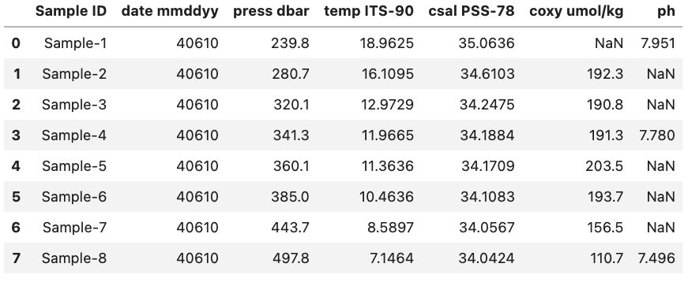
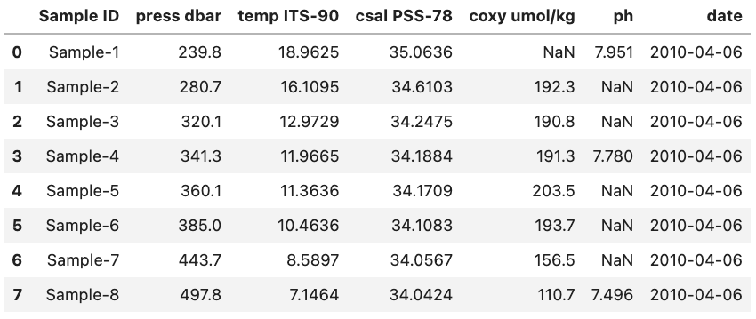
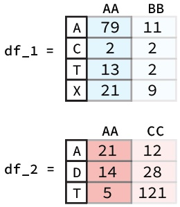
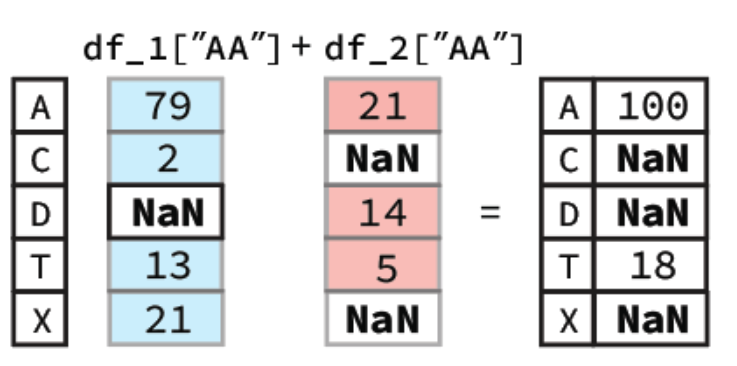
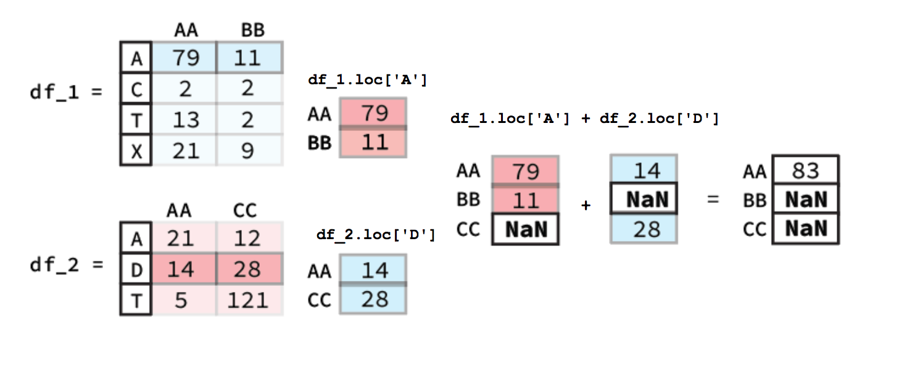

# `DataFrame` Attributes & Arithmetic

Once you have loaded in one or more `DataFrame`s you may want to investigate various aspects of the data. This could be by looking at the shape of the `DataFrame` or the mean of a single column. This could also be through arithmetic between different `DataFrame` columns (i.e. `Series`). The following episode will focus on these two concepts and will help you better understand how you can analyze the data you have loaded into Pandas.

## `DataFrame` Attributes

It is often useful to quickly explore some of the descriptive attributes and statistics of the dataset that you are working with. For instance, the shape and datatypes of the DataFrame, and the range, mean, standard deviation, etc. of the rows or columns. You may find interesting patterns or possibly catch errors in your dataset this way. As we will see, accessing these attributes and computing the descriptive statistics is easy with pandas.

`DataFrames` have a number of attributes associated with them. With respect to exploring your dataset, perhaps the 4 most useful attributes are summarized in the table below:

| Attribute |Description|
|:----------|-----------|
| `shape`| Returns a tuple representing the dimensionality of the `DataFrame`. |
| `size` | Returns an int representing the number of elements in this object.  |
| `dtypes` | Returns the data types in the `DataFrame`. |
| `columns` | Returns a `Series` of the header names from the `DataFrame`|

A list of all the `DataFrame` attributes can be found on the pandas website ([Link to `DataFrame` Docs](https://pandas.pydata.org/pandas-docs/stable/reference/api/pandas.DataFrame.html)).

### Inspecting Data Types

`DataFrame` types are important since they will determine what methods can be used. For example you can't compute the mean of a Object column that contains strings (i.e. words).

One attribute that we have already used previously was the columns attribute that returns the name of each column header

~~~
df.columns
~~~
{: .language-python}

That returns:

~~~
Index(['Sample ID', 'date mmddyy', 'press dbar', 'temp ITS-90', 'csal PSS-78',
       'coxy umol/kg', 'ph'],
      dtype='object')
~~~
{: .output}

However, what if we wanted to see the data type associated with each column header? Luckily, there is a quick and easy way to do this by accessing the `dtypes` attribute. `dtypes` is a series maintained by each `DataFrame` that contains the data type for each column inside a `DataFrame`. As an example if we want to access the `dtypes` attribute the `DataFrame` called `df` (seen below) we can access the `dtypes` of the `DataFrame`.

~~~
df.dtypes
~~~
{: .language-python}

This will produce the output:

~~~
Sample ID        object
date mmddyy       int64
press dbar      float64
temp ITS-90     float64
csal PSS-78     float64
coxy umol/kg    float64
ph              float64
dtype: object
~~~
{: .output}

> ## Data Types
>
> Remember that Pandas has a number of different data types:
>
> | Python Type       | Equivalent Pandas Type | Description                                                                                                       |
> | :---------------- | :--------------------- | :---------------------------------------------------------------------------------------------------------------- |
> | `string or mixed` | `object`               | Columns contain partially or completely made up from strings                                                      |
> | `int`             | `int64`                | Columns with numeric (integer) values. The 64 here refers  to size of the memory space allocated to this type |
> | `float`           | `float64`              | Columns with floating points numbers (numbers with decimal points)                                                |
> | `bool`            | `bool`                 | True/False values                                                                                                 |
> | `datetime`        | `datetime`             | Date and/or time values                                                                                                   |
{: .callout}

While Pandas is usually pretty good at getting the type of a column right sometimes you might need help it by providing the type when the data is loaded in or by converting it to a more suitable format.

As an example we are going to use the column 'date mmddyy' to create a new column just called 'date' that has the type `datetime`.

To start we can convert the information stored in 'date mmddyy' into a new `Series` with the `datetime` type. To do this we call the `to_datetime` method and provide the `Series` we want it to convert from as a parameter. Additionally we also need to specify the format that our date format is in. In our case we have month day and then year with each denoted by two numbers and no separators. To tell `to_datetime` that our data is formatted in this way we pass '%m%d%y' to the `format` parameter. This format parameter input is based on native python string conversion to `datetime` format more information can be found on on the python docs ([Link to string to `datetime` conversion docs](https://docs.python.org/3/library/datetime.html#strftime-and-strptime-behavior))

More information on the to_datetime method can be found on the Pandas website ([Link to `to_datetime` method docs](https://pandas.pydata.org/docs/reference/api/pandas.to_datetime.html)).

~~~
pd.to_datetime(df['date mmddyy'], format='%m%d%y')
~~~
{: .language-python}

~~~
0   2010-04-06
1   2010-04-06
2   2010-04-06
3   2010-04-06
4   2010-04-06
5   2010-04-06
6   2010-04-06
7   2010-04-06
Name: date mmddyy, dtype: datetime64[ns]
~~~
{: .output}

Now that we have the correct output format we can create a new column to hold the converted data in by creating a new named column. We will also drop the previously used 'date mmddyy' column to prevent confusion. Lastly, we will display the types for each of the columns to check that everything went the way we wanted it to.

~~~
df["date"] = pd.to_datetime(df['date mmddyy'], format='%m%d%y')
df = df.drop(columns=["date mmddyy"])
df.dtypes
~~~
{: .language-python}

~~~
Sample ID               object
press dbar             float64
temp ITS-90            float64
csal PSS-78            float64
coxy umol/kg           float64
ph                     float64
date            datetime64[ns]
dtype: object
~~~
{: .output}

For reference this is what the final `DataFrame` looks like. **Note that the date column is at the right side of the `DataFrame` since it was added last.**

### `DataFrame` Methods

When dealing with a `DataFrame` there are a variety of built-in methods to help summarize the data found inside it. These are accessible using e.g. `df.method()` where `df` is a `DataFrame`. A list of some of these methods can be seen below:

| Method|Description|
|:----------|-----------|
| `head()`| Return the first n rows. |
| `tail()` | Return the last n rows. |
| `min()`, `max()` | Computes the numeric (for numeric value) or alphanumeric (for object values) row-wise min, max in a Series or DataFrame.|
| `sum()`, `mean()`, `std()`, `var()`   | Computes the row-wise sum, mean, standard deviation and variance in a `Series` or DataFrame.|
|`nlargest()`|\tReturn the first n rows of the `Series` or `DataFrame`, ordered by the specified columns in descending order. |
| `count()` |  Returns the number of non-NaN values in the in a `Series` or `DataFrame`. |
| `value_counts()` |  Returns the frequency for each value in the `Series`. |
| `describe()` | Computes row-wise statistics. |

A full list of methods for `DataFrame`s can be found in the Pandas docs ([Link to `DataFrame` Docs](https://pandas.pydata.org/pandas-docs/stable/reference/api/pandas.DataFrame.html)).

Some of these we have already dealt with e.g. `value_counts()` while others are fairly self descriptive e.g. `head()` and `tail()`. Below we will deal with one method `mean()` that is a good representative for how most of the methods work and another `describe()` that is a bit more tricky.

#### `mean()` Method

The `mean()` method calculates the mean for an axis (rows = 0, columns = 1). As an example let's return to our previous `DataFrame` `df`.

If we want to find the mean of all of our numeric columns we would give the following command

~~~
df.mean(numeric_only=True)
~~~
{: .language-python}

This will produce the output:

~~~
date mmddyy     40610.000000
press dbar        358.562500
temp ITS-90        12.196838
csal PSS-78        34.311013
coxy umol/kg      176.971429
ph                  7.742333
dtype: float64
~~~
{: .output}

**Note: only the columns with numeric data types had their means calculated.**

> ## Single Column (`Series`) Methods
>
> If we only want the mean of a single column we would instead give the `mean()` method a single column (i.e. a `Series`). This could be done for the latitude column in the example above via the code bit `df['Latitude'].mean()` which would return a single value 31.09682 which is the mean of that column (as seen above).
>
>
{: .callout}

Other methods like `max()`, `var()`, and `count()` function in much the same way.

#### `describe()` Method

A method that is a bit more tricky to understand is the `describe()` method. This method provides a range of statistics about the `DataFrame` depending on the contents. For example if we were to run `describe()` on the previously mentioned `DataFrame` called `df` using the code bit below. 

> ## Single Column (`Series`) Methods
>
> By default the `describe()` method will only use numeric columns. To tell it to use all columns regardless of whether they are numeric or not we have to set `include='all'`-
>
>
{: .callout}

~~~
df.describe(include='all', datetime_is_numeric=True)
~~~
{: .language-python}

We would get the output:

~~~
       Sample ID  press dbar  temp ITS-90  csal PSS-78  coxy umol/kg  \
count          8    8.000000     8.000000     8.000000      7.000000   
unique         8         NaN          NaN          NaN           NaN   
top     Sample-1         NaN          NaN          NaN           NaN   
freq           1         NaN          NaN          NaN           NaN   
mean         NaN  358.562500    12.196838    34.311013    176.971429   
min          NaN  239.800000     7.146400    34.042400    110.700000   
25%          NaN  310.250000     9.995125    34.095400    173.650000   
50%          NaN  350.700000    11.665050    34.179650    191.300000   
75%          NaN  399.675000    13.757050    34.338200    193.000000   
max          NaN  497.800000    18.962500    35.063600    203.500000   
std          NaN   83.905762     3.853666     0.353064     32.726376   

              ph                 date  
count   3.000000                    8  
unique       NaN                  NaN  
top          NaN                  NaN  
freq         NaN                  NaN  
mean    7.742333  2010-04-06 00:00:00  
min     7.496000  2010-04-06 00:00:00  
25%     7.638000  2010-04-06 00:00:00  
50%     7.780000  2010-04-06 00:00:00  
75%     7.865500  2010-04-06 00:00:00  
max     7.951000  2010-04-06 00:00:00  
std     0.229827                  NaN  
~~~
{: .output}

Here we get statistics regarding e.g. the mean of each column, how many non-NaN values are found in the columns, the standard deviation of the column, etc. The percent values correspond to the different percentiles of each column e.g. the 25% percentile. The NaN values are since we can't get e.g. the `mean()` of an `object` type column. More information about the `describe()` method can be found on the Pandas website ([Link to `describe()` method docs](https://pandas.pydata.org/pandas-docs/stable/reference/api/pandas.DataFrame.describe.html)).

## `DataFrame` Arithmetic

There may also come a time where we might want to do arithmetic between two different `DataFrame` columns or rows. Luckily, Pandas helps make this very simple. For example if had two `DataFrame`s like the ones below and we wanted to add the 'AA' columns together we would simply use the following code bit:

~~~
df_1["AA"] + df_2["AA"]
~~~
{: .language-python}

To calculate this Pandas will first align the two columns (`Series`) based on their indexes. Following this any indexes that contain values in both `Series` will have their sum calculated. However, for indexes where one of the `Series` value is NaN the output value will be NaN. A diagram of this process is shown below:

In our notebook we would get a `Series` as our output:

~~~
A    100.0
C      NaN
D      NaN
T     18.0
X      NaN
Name: AA, dtype: float64
~~~
{: .output}

> ## `DataFrame` Row Arithmetic
>
> Calculating the sum of different rows is pretty similar to column-wise calculations. The key difference is that you must used a method of selecting rows e.g. `.loc` an example figure is shown below.
>
> 
>
{: .callout}

Beyond just individual columns or rows you can also apply the same method to do arithmetic between two entire `DataFrame`s. The only thing that changes is that both the column and the index must be found in a in order for there to be an output. You can imagine that doing arithmetic between two entire `DataFrame`'s functions in much the same way if you did it column by column and then turned all the resulting column `Series` into a new `DataFrame`.

### Broadcasting

Pandas also allows you to do arithmetic operations between a `DataFrame` or `Series` and a scalar (i.e. a single number). If you were to do the following code bit using the 'AA' column from the previously described `DataFrame` called `df_1`

~~~
df_1["AA"] + 0.3
~~~
{: .language-python}

You would get the output:

~~~
A    79.3
C     2.3
T    13.3
X    21.3
Name: AA, dtype: float64
~~~
{: .output}

Here you essentially just add 0.3 to each entry in the `Series`. The same occurs if you were to do it for a whole `DataFrame` with 0.3 being added to each entry. **Note:** this only works for `DataFrame`s that are entirely numeric, if there are any object columns you will get an error message.
