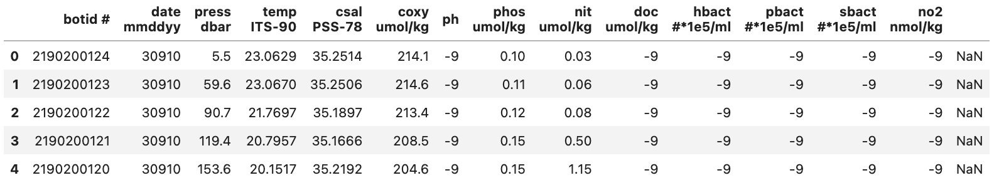
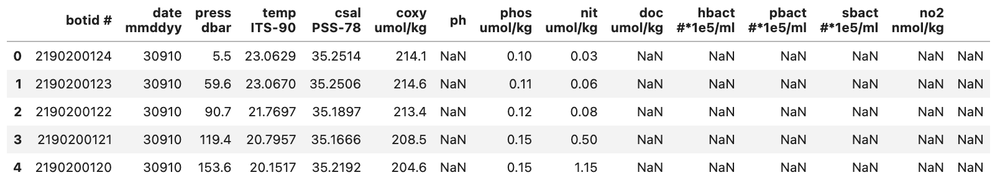
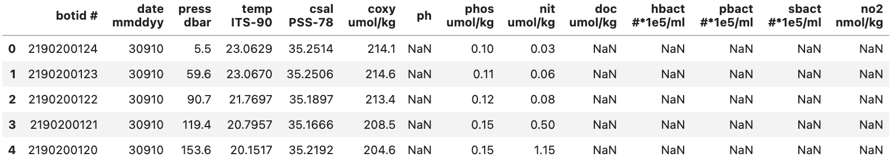
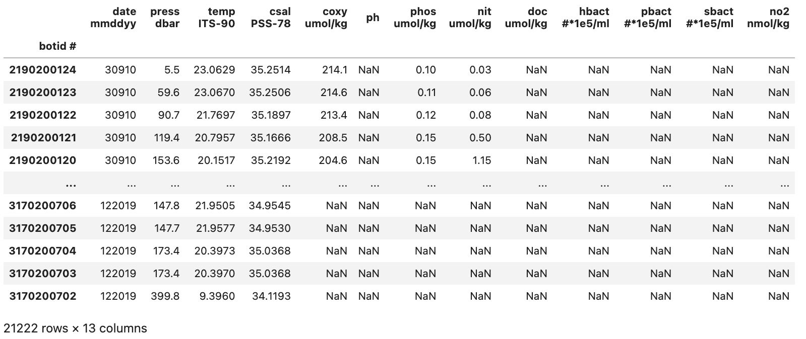
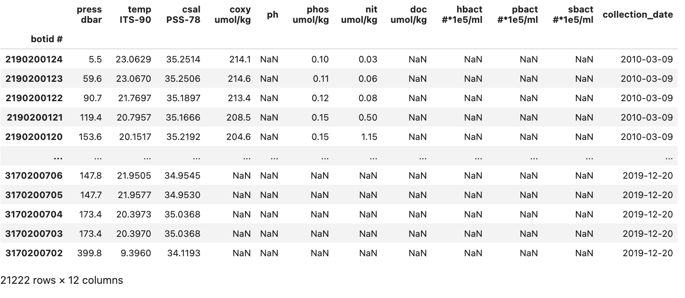

# Cleaning Real Data

The previous episodes have focused on key concepts with small datasets and/or made up data. However, these examples can only take you so far. For this reason the remaining lessons and examples will be focused on an actual dataset from the Hawaiian Ocean Time-Series (HOT) data website ([Link to HOT Data Website](https://hahana.soest.hawaii.edu/hot/hot-dogs/)). This website allows you to query data generated by the time-series through various modules.

Going forward we are going to be using data from HOT between the 1st of January 2010 to the 1st of January 2020. This particular data we are going to be utilizing comes from bottle extractions between depths 0 to 500m. The environmental variables that we will be looking at include:

| Column name     | Environmental Variable                 |
| --------------- | -------------------------------------- |
| botid #         | Bottle ID                              |
| date mmddyy     | Date                                   |
| press dbar      | Pressure                               |
| temp ITS-90     | Temperature                            |
| csal PSS-78     | Salinity                               |
| coxy umol/kg    | Oxygen concentration                   |
| ph              | pH                                     |
| phos umol/kg    | Phosphate concentration                |
| nit umol/kg     | Nitrate + Nitrite concentration        |
| no2 nmol/kg     | Nitrite concentration                  |
| doc umol/kg     | Dissolved Organic Carbon concentration |
| hbact #\*1e5/ml | Heterotrophic Bacteria concentration   |
| pbact #\*1e5/ml | Prochlorococcus numbers                |
| sbact #\*1e5/ml | Synechococcus numbers                  |

The data contains over 20000 individual samples. To analyze the data we are going to clean it up. Then, in the next episode we will analyze and visualize it. To do this we will be using some of tricks we have already learn while also introducing some new things. **Note:** The dataset we are using has been modified from its original format to reduce the amount of cleaning up we need to do.

## Cleaning Up

### `DataFrame` Content Cleanup

During our initial clean up we will only load in the first few rows of our dataset entire `DataFrame`. This will make it easier to work with and less daunting.

~~~
pd.read_csv("./data/hot_dogs_data.csv", nrows=5)
~~~
{: .language-python}

This will show us the `DataFrame` seen below:

From this we can see a few things:

- There are a lot of -9 values
  - This is likely to denote Null values in the dataset
- The last column (to the right of the no2 column) doesn't seem to contain a header or any data

Both of these issues can easily be fixed using Pandas and things we've learn previously.

To start off lets fix the first problem we saw which was was the large number of -9 values in the dataset. These are especially strange for some of the columns e.g. how can there be a negative concentration of hbact i.e. heterotrophic bacteria? This is a stand in for places where no measurement was obtained.

> ## Treating -9 values as NaN values when loading data
>
> To start off try fixing the read_csv() method so that all -9 values are treated as NaN values. If you are stuck try going back to the episode on this topic ([Link to loading data episode](#tmp)).
> 
> > ## Solution
> > To fix this we can add the parameter `na_values=-9` to the `read_csv()` method giving us the following code bit.
> > ~~~
> > pd.read_csv("./data/hot_dogs_data.csv", nrows=5, na_values=-9)
> > ~~~
> > {: .language-python}
> > Below shows how our `DataFrame` now looks:
> > 
> {: .solution}
{: .challenge}

With this we have fixed the problematic -9 values from our initial `DataFrame`.

> ## Temperature Column
>
> The temperature column could technically contain -9 values. However, all temperature measurements were above 0 so this is not an issue.
>
{: .callout}

The second problem we identified was that there was an extra column (with no header) made up of only `NaN` values. This is probably an issue with the original file and if we were to take a look at the raw .csv file we find that each row ends with a ','. This causes `read_csv` to assume that there is another column with no data since it looks for a new line character (`\n`) to denote when to start a new row.

There are various methods to deal with this. However, we are going to use a relative simple method that we've already learn. As we discussed in a previous episode pandas `DataFrame`s have a method to drop columns (or indexes) called `drop`. Where if we provide it with the correct inputs it can drop a column based on its name. Knowing this we can chain our `read_csv` method with the drop method so that we load in the blank column and then immediately remove it.

> ## Dropping the blank column 
> 
> The final command we will be using can be seen below. However, the columns parameter is missing any entries in its list of columns to drop. You will be fixing this by adding the name of the column that is empty (hint: the name isn't actually empty).
> ~~~
> pd.read_csv("./data/hot_dogs_data.csv", nrows=5, na_values=-9).drop(columns=[])
> ~~~
> {: .language-python}
> To get the name of the column we will want to utilize a `DataFrame` attribute that we have already discussed that provides us with the list of names in the same order they occur in the `DataFrame`. If you are stuck check the previous episode where we discussed this ([Link to previous episode]()).
> 
> > ## Solution
> > To get the name of the columns we can simply access the `columns` `Series` attribute that ever `DataFrame` has. This can be done either through chaining it after our `read_csv` method or by store it in a variable and then call the method using that variable. Below we use the chain approach.
> > 
> > ~~~
> > pd.read_csv("./data/hot_dogs_data.csv", nrows=5, na_values=-9).columns
> > ~~~
> > {: .language-python}
> > 
> > ~~~
> > Index(['botid #', ' date mmddyy', ' press dbar', ' temp ITS-90',
       ' csal PSS-78', ' coxy umol/kg', ' ph', ' phos umol/kg', ' nit umol/kg',
       ' doc umol/kg', ' hbact #*1e5/ml', ' pbact #*1e5/ml', ' sbact #*1e5/ml',
       ' no2 nmol/kg', ' '],
      dtype='object')
> > ~~~
> > {: .output}
> > The last entry in the `Series` is our 'blank' column i.e. `' '`. We add this as the only entry to our drop method and get the following code bit.
> > ~~~
> > pd.read_csv("./data/hot_dogs_data.csv", nrows=5, na_values=-9).drop(columns=[" "], axis=1)
> > ~~~
> > {: .language-python}
> {: .solution}
> This then gives us the output `DataFrame` seen below:
> 
{: .challenge}

With this we have fixed some of the initial issues related to our dataset. It should be noted that there might still exist other issues with our dataset since we have only relied on the first few rows.

> ## Column Names
>
> Checking the `columns` attribute even if nothing immediately looks wrong can be good in order to spot e.g. blank spaces around column names that can lead to issues.
>
{: .callout}

One final thing that we are going to do that is not quite "clean up" but nonetheless important is to set our index column when we load the data. The column we are going to use for this is the 'botid #' column. We can also remove the `nrows=5` parameter since we want to load the whole `DataFrame` starting in the next section.

> ## Setting the index column when loading data
> 
> To set the index column we can use a parameter in `read_csv` that was mentioned in a previous episode. See if you can remember it! If you run into trouble you can take a look at the previous episode where it was mentioned ([Link to prev episode]()).
> 
> > ## Solution
> > To set the index column when we load the data we just have to add the parameter `index_col` and set it to 'botid #'. **Note:** we have removed the `nrows=5` parameter in the code bit below since we no longer need it.
> > 
> > ~~~
> > pd.read_csv("./data/hot_dogs_data.csv", na_values=-9, index_col="botid #").drop(columns=[" "], axis=1)
> > ~~~
> > {: .language-python}
> {: .solution}
{: .challenge}

This gives us a somewhat cleaned up `DataFrame` that looks like the image below:

With our initial cleanup done we can now save the current version of our `DataFrame` to the `df` variable. This `df` variable will be used for the next two sections.

## `DataFrame` Column Types

Now that we have fixed the initial issues we could glean from an initial look at the data we can take a look at the types that Pandas assumed for each of our columns. To do this we can access the .dtypes attribute.

~~~
df.dtypes
~~~
{: .language-python}

~~~
 date mmddyy         int64
 time hhmmss         int64
 press dbar        float64
 temp ITS-90       float64
 csal PSS-78       float64
 coxy umol/kg      float64
 ph                float64
 phos umol/kg      float64
 nit umol/kg       float64
 doc umol/kg       float64
 hbact #*1e5/ml    float64
 pbact #*1e5/ml    float64
 sbact #*1e5/ml    float64
 no2 nmol/kg       float64
dtype: object
~~~
{: .output}

Most of the columns have the correct type with the exception of the 'date mmddyy' column that has the int64 type. Pandas has a built in type to format date and time columns and conversion of the date column to this datetime type will help us later on.

To change the type of a column from an int64 to a datetime type is a bit more difficult than e.g. a int64 to float64 conversion. This is because we both need to tell Pandas the type that we want it to convert the column's data to and the format that it is in. For our data this is MMDDYY which we can give to Pandas using `format='%m%d%y'`. This format parameter can be very complicated but is based on native python more information can be found on the `to_datetime` method docs ([Link to datetime method docs](https://pandas.pydata.org/docs/reference/api/pandas.to_datetime.html)).

The code bit below creates a new column called 'date' that contains the same data for each row as is found in the 'date mmddyy' column but instead with the datetime64 type. It will **not** delete the original 'date mmddyy' column.

~~~
df["collection_date"] = pd.to_datetime(df['date mmddyy'], format='%m%d%y')
df.dtypes
~~~
{: .language-python}

~~~
date mmddyy                int64
time hhmmss                int64
press dbar               float64
temp ITS-90              float64
csal PSS-78              float64
coxy umol/kg             float64
ph                       float64
phos umol/kg             float64
nit umol/kg              float64
doc umol/kg              float64
hbact #*1e5/ml           float64
pbact #*1e5/ml           float64
sbact #*1e5/ml           float64
no2 nmol/kg              float64
date              datetime64[ns]
dtype: object
~~~
{: .output}

We can see from the output that we have all of our previous columns with the addition of a 'date' column with the type datetime64. If we take a look at the new column we can see that it has a different formatting compared to the 'date mmddyy' column

~~~
df["collection_date"]
~~~
{: .language-python}

~~~
botid #
2190200124   2010-03-09
2190200123   2010-03-09
2190200122   2010-03-09
2190200121   2010-03-09
2190200120   2010-03-09
                ...    
3170200706   2019-12-20
3170200705   2019-12-20
3170200704   2019-12-20
3170200703   2019-12-20
3170200702   2019-12-20
Name: collection_date, Length: 21222, dtype: datetime64[ns]
~~~
{: .output}

Now that we've added this column (which contains the same data as found in 'date mmddyy' just in a different format) there is no need for the original date mmddyy column so we can drop it.

~~~
df = df.drop(columns=["date mmddyy"])
~~~
{: .language-python}

## `DataFrame` Overview

A final thing we will want to do before moving on to the analysis episode is to get an overview of our `DataFrame` as a final way of checking to see if anything is wrong. To do this we can use the `describe()` method which we discussed earlier.

~~~
df.describe()
~~~
{: .language-python}

~~~
         time hhmmss    press dbar   temp ITS-90   csal PSS-78  coxy umol/kg  \
count   21222.000000  21222.000000  21222.000000  21210.000000   3727.000000   
mean   103238.977523    119.381105     21.570407     35.020524    198.222297   
std     68253.013809    120.193833      4.961006      0.382516     27.787824   
min         3.000000      0.800000      6.055800     34.018800     30.900000   
25%     40625.000000     25.500000     20.625800     34.922500    199.350000   
50%    101309.000000     89.700000     23.109450     35.138700    207.200000   
75%    154822.000000    150.900000     24.742175     35.281500    212.000000   
max    235954.000000    500.000000     28.240100     35.556400    230.900000   

               ph  phos umol/kg  nit umol/kg  doc umol/kg  hbact #*1e5/ml  \
count  885.000000   2259.000000  2253.000000   868.000000      750.000000   
mean     7.956939      0.448331     5.505113    63.688341        3.933479   
std      0.158210      0.638772     9.159562    10.287748        1.173908   
min      7.366000      0.000000     0.000000    41.270000        1.481000   
25%      7.898000      0.070000     0.020000    55.467500        2.976250   
50%      8.035000      0.120000     0.240000    67.395000        4.042000   
75%      8.065000      0.520000     6.620000    72.282500        4.809500   
max      8.105000      2.610000    35.490000    80.460000        7.889000   

       pbact #*1e5/ml  sbact #*1e5/ml  no2 nmol/kg  
count      749.000000      750.000000          0.0  
mean         1.364606        0.010932          NaN  
std          0.938620        0.011851          NaN  
min          0.000000        0.000000          NaN  
25%          0.337000        0.000000          NaN  
50%          1.643000        0.009000          NaN  
75%          2.176000        0.016000          NaN  
max          3.555000        0.091000          NaN  
~~~
{: .output}

A look at the output shows us that the 'no2 nmol/kg' column does not contain any useable data based on its count value being 0. This then leads to the NaN for e.g. the min and max values. Since this column doesn't contain any information of interest we can drop it to clean up our `DataFrame`.

~~~
df = df.drop(columns=["no2 nmol/kg"])
~~~
{: .language-python}

With this done our data is reasonably cleaned up and we have the `DataFrame` seen in the image below:

We can now move on to the analysis and visualization of the data in our `DataFrame`.

## Summary

With this we've clean up our initial dataset. To summarize we have:

1. Replaced the -9 placeholder for Null values with NaN values
2. Fixed an issue with an extra column containing no data
3. Added a custom row index
4. Converted the data in 'date mmddyy' to a Pandas supported datetime type
5. Dropped two columns:
   - 'date mmddyy' column since the new 'date' column contains the same data but in a better type
   - 'no2 nmol/kg' column since it contained no data
