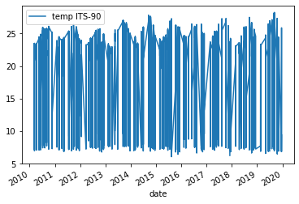
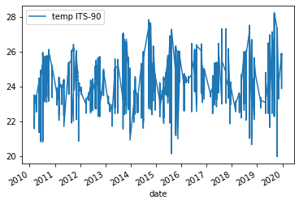
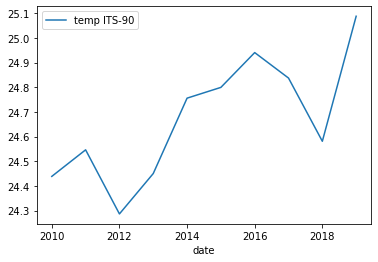
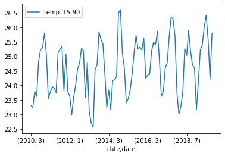
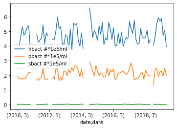

[](https://mybinder.org/v2/gh/CI-TRACS/Data_Wrangling_with_Computational_Notebooks/HEAD)

# Analyzing Real Data

This episode continues from the previous one and utilizes the final `DataFrame` described there.

## Analysis

Before we get started on our analysis let us take stock of how much data we have for the various columns. To do this we can use two `DataFrame` methods that we've previously used.

First we can check how many rows of data we have in total. We can check this easily through the shape attribute of the `DataFrame`

```
df.shape
```

{: .language-python}

```
(21222, 13)
```

{: .output}

From this we can see that we have 21222 rows in our data and 13 columns. So at most we can have 21222 rows of data for each column. However, as we saw during the cleaning phase there are NaN values in our dataset so many of our columns won't contain data in every row.

To check how many rows of data we have for each column we can again use the `describe()` method. It will count how many row of data are **not** NaN for each column. To reduce the size of the output we will use `loc` to only view the counts for each column.

```
df.describe().loc["count",:]
```

{: .language-python}

```
time hhmmss       21222.0
press dbar        21222.0
temp ITS-90       21222.0
csal PSS-78       21210.0
coxy umol/kg       3727.0
ph                  885.0
phos umol/kg       2259.0
nit umol/kg        2253.0
doc umol/kg         868.0
hbact #*1e5/ml      750.0
pbact #*1e5/ml      749.0
sbact #*1e5/ml      750.0
Name: count, dtype: float64
```

{: .output}

As we can see we have highly variable amounts of data for each of our column. We will ignore pressure since it is roughly a depth estimate. These fit fairly neatly into three groups:

1. Data that is found in almost all rows
   - Temperature
   - Salinity
2. Data that is found in around 2000-4000 samples
   - Oxygen
   - Phosphorus
   - Nitrate+Nitrite
3. Data that is found in fewer than 1000 samples
   - pH
   - Dissolved organic carbon
   - Heterotrophic bacteria
   - Prochlorococcus
   - Synechococcus

Note here that pressure is roughly akin to "depth" so we won't be using it.

### `GroupBy` and Visualization

To start off we can focus on the measurements that we have plenty of data for. 

> ## Plotting Temperature
>
> We can quickly get a matplotlib visualization for temperature by calling the `plot` method from our `DataFrame`. We can tell it what columns we want to use as the x axis and y axis via the parameters `x` and `y`. The `kind` parameter lets the `plot()` method know what kind of plot we want e.g. line or scatter. For more information about the plot function check out the docs ([Link to plot method docs](https://pandas.pydata.org/docs/reference/api/pandas.DataFrame.plot.html)).
> ~~~
> df.plot(x="date", y="temp ITS-90", kind="line")
> ~~~
> {: .language-python}
> > ## Solution
> > Below is the output plot
> > 
> {: .solution}
{: .challenge}

However, the plot we get is very messy. We see a lot of variation from around 25°C to 7°C year to year and the lines are clustered very tightly together.

> ## Plotting Surface Temperature
>
> Part of the reason we got this messy plot is because we are utilizing all the temperature values in our dataset, regardless of depth (i.e. pressure). To resolve some of the variation we can ask Pandas to only plot data that is from roughly the top 100m of the water column this would be roughly any rows that come from pressures of less than 100 dbar.
> ```
> surface_samples = df[df["press dbar"] < 100]
> surface_samples.plot(x="date", y="temp ITS-90", kind="line")
> ```
> {: .language-python}
> > ## Solution
> > Below is the output plot
> > 
> {: .solution}
{: .challenge}

Now we can see that we have removed some of the variation we saw in the previous figure. However, it is still somewhat difficult to make out any trends in the data. One way of dealing with this would be to e.g. get the average temperature for each year and then plot those results.

To this we will introduce a new method called `groupby` which allows us to run calculations like `mean()` on groups we specify. For us we want to get the mean temperature for each year. Thanks to our previous work in setting up the date column type this is very easy. We can also reuse `surface_samples` to only get samples from the upper 100m of the water column.

```
grouped_surface_samples = surface_samples.groupby(df.date.dt.year).mean()
```

{: .language-python}

```
        time hhmmss  press dbar  temp ITS-90  csal PSS-78  coxy umol/kg  \
date
2010  111193.170920   37.517015    24.438342    35.282562    213.306024
2011  108457.713156   40.025449    24.545986    35.225530    210.137566
2012  103491.885435   37.503730    24.286195    35.200273    211.909375
2013  110479.360743   38.544562    24.449899    35.302473    211.057143
2014  107638.631016   40.763369    24.755485    35.287073    211.538974
2015  108635.305970   37.930929    24.799153    35.210472    210.160287
2016  101880.099391   37.814300    24.940249    34.995771    208.771186
2017  106559.737030   36.499374    24.836940    35.000984    211.143750
2018  103767.267879   37.064727    24.580730    34.999648    213.029371
2019  104902.595131   38.461587    25.087561    34.805649    212.239130

            ph  phos umol/kg  nit umol/kg  doc umol/kg  hbact #*1e5/ml  \
date
2010  8.063846      0.075842     0.033465    73.810154        4.614946
2011  8.072089      0.056455     0.029464    74.384000        4.651204
2012  8.061535      0.114953     0.018224    72.578871        4.787081
2013  8.064927      0.087264     0.026981    71.548413        4.778000
2014  8.069786      0.065983     0.025652    72.237091        4.845439
2015  8.065829      0.071795     0.029211    70.894154        4.838659
2016  8.072237      0.068108     0.055676    72.562131        4.467324
2017  8.064918      0.052946     0.033514    70.556863        4.744976
2018  8.054656      0.060000     0.085250          NaN        4.555553
2019  8.061786      0.060093     0.021667          NaN        5.084833

      pbact #*1e5/ml  sbact #*1e5/ml
date
2010        1.909351        0.014351
2011        1.783857        0.019388
2012        1.968270        0.015351
2013        2.345216        0.020162
2014        2.223146        0.018927
2015        2.182341        0.018386
2016        2.127529        0.014471
2017        2.109878        0.019927
2018        2.035622        0.020711
2019        2.123119        0.015214
```
{: .output}

We see now that the new `DataFrame` generated by `groupby()` and `mean()` contains the mean for each year for each of our columns. 


> ## Plotting Yearly Surface Temperature
>
> Now we can just run the same plot method as previously but using `grouped_surface_samples` instead of `surface_samples`.
> ```
> grouped_surface_samples.plot(x="date", y="temp ITS-90", kind="line")
> ```
> {: .language-python}
> 
> > ## Solution
> > Below is the output plot
> > 
> {: .solution}
{: .challenge}

Now it looks a lot smoother, but now we have another issue. We've smoothed out any month to month variations that are present in the data. To fix this we can instead use the `groupby` method to group by year and month.

```
grouped_surface_samples = surface_samples.groupby([(surface_samples.date.dt.year),(surface_samples.date.dt.month)]).mean()
```
{: .language-python}

> ## Plotting Monthly Surface Temperature
>
> If we plot this we get a month by month plot of temperature variations.
> ```
> grouped_surface_samples.plot(y="temp ITS-90", kind="line")
> ```
> {: .language-python}
> 
> > ## Solution
> > Below is the output plot
> > 
> {: .solution}
{: .challenge}

While we have been focusing on temperature there is no reason that we can't redo the same plots that we have been making with measurements other than temperature. We can also plot multiple measurements at the same time if we want to as well.

> ## Plotting Monthly Surface Temperature
>
> To test this we will try plotting the abundance of Prochlorococcus, Synechococcus, and heterotrophic bacteria.
> ```
> grouped_surface_samples.plot(y=["hbact #*1e5/ml", "pbact #*1e5/ml",
                                "sbact #*1e5/ml"], kind="line")
> ```
> {: .language-python}
> 
> > ## Solution
> > Below is the output plot
> > 
> {: .solution}
{: .challenge}

With that we plotted looked various methods of plotting the data we have in our dataset. We've also learned how to group different measurements depending on when the measurement was taken. If you are interested you can keep testing different methods of grouping the data or plotting some of the measurements that we did not use e.g. pH or dissolved organic carbon (`doc umol/kg`).

Hopefully throughout this lesson you have learned some useful skills in order to both analyze your data and document your analysis and any code that you used. There is plenty of things that we did not have time to go over so make sure to keep learning!
