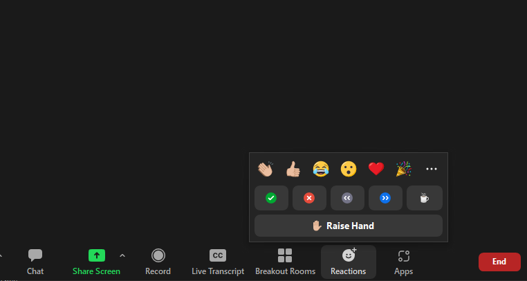
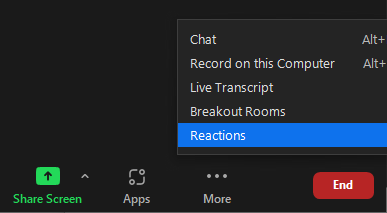

---
# Feedback during the workshop

We encourage participants to write comments and questions in chat and use the <a href="https://support.zoom.us/hc/en-us/articles/115001286183-Nonverbal-feedback-during-meetings#:~:text=To%20provide%20nonverbal%20feedback%20or,icon%20again%20to%20remove%20it." target="_blank" >non-verbal feedback features of zoom</a>.

If at any time you have a question that is easier to talk through than writing it in chat, please indicate in chat you have a question or raise your virtual hand so that we know you wish to speak.





# Setup

No local setup is required for this lesson since everything will be taken care of through Binder. The link to the Binder repo can be found at the start of each episode.

If Binder has some issue for this workshop you can utilize the University of Hawaii Mana HPC cluster to run the notebooks if you do not have Anaconda installed on your own machine.

In order to use Mana go to https://mana.its.hawaii.edu and input your UH credentials.  

For details on how to access the cluster and launch and interactive jupyterlab/notebook session please see the HPC workshop materials here https://ci-tracs.github.io/High_Performance_Computing/10-hpc/index.html.

After starting an interactive Jupyter session you can launch a "terminal" and within the terminal you can run the following
```
git clone https://github.com/CI-TRACS/Data_Wrangling_with_Computational_Notebooks.git
```
This will copy the workshop materials and notebooks to your home directory on Mana.  You can then use the file browser in Jupyter to navigate to '/Data_Wrangling_with_Computational_Notebooks/notebooks/' and then open the notebooks that correspond with the episodes.


